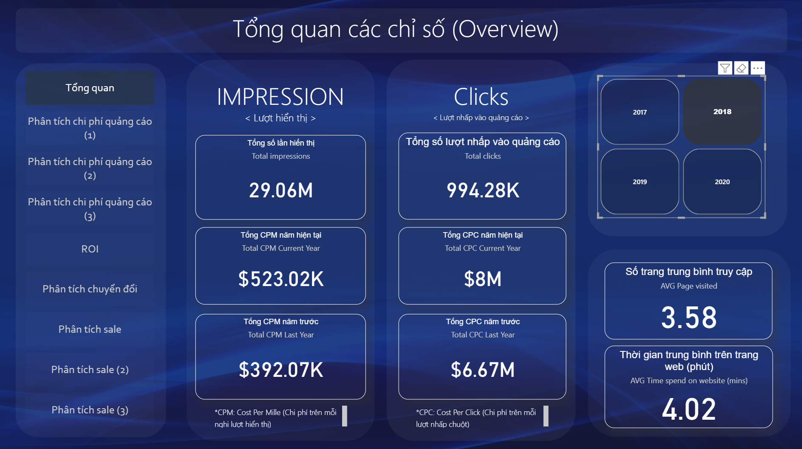
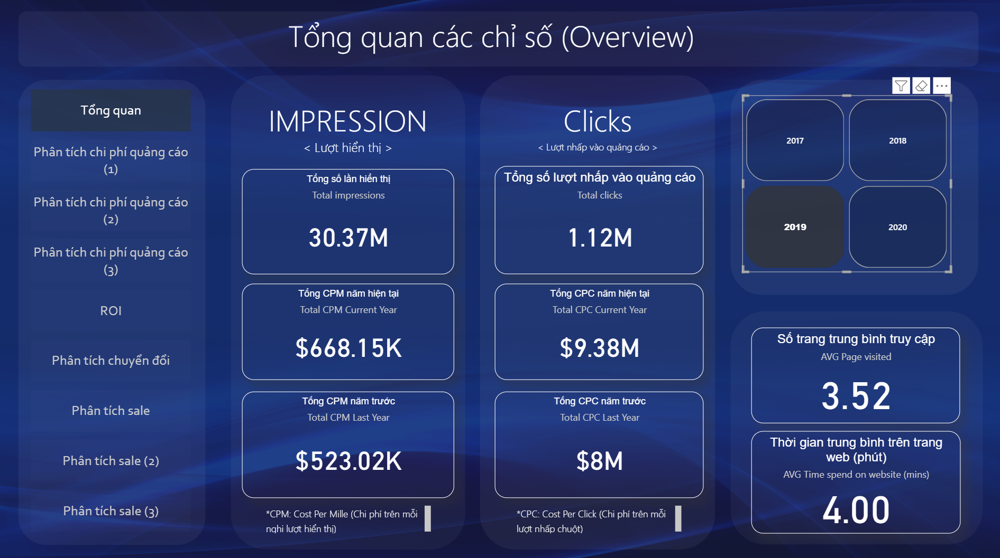
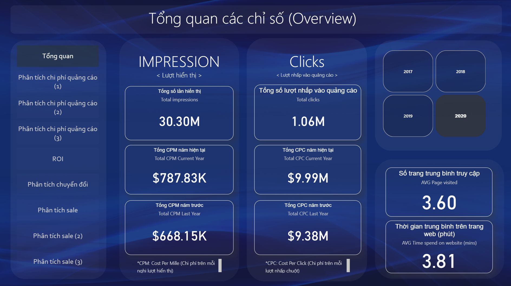

# 📊 Marketing Performance Dashboard

A **data analytics dashboard** designed to track and evaluate marketing performance across advertising channels and campaigns.  
The dashboard analyzes key metrics such as **impressions, clicks, conversions, and campaign effectiveness** to support **data-driven marketing decisions**.

---

# 📈 Marketing Campaign Performance Overview

## 📊 1. Impressions (Lượt hiển thị)

| Metric | Value |
|------|------|
| Total Impressions | **24.50M** |
| Total CPM (Current Year) | **$392.07K** |
| Total CPM (Last Year) | Not available |

💡 **Insight**

The campaign generated a **large number of impressions**, indicating **strong visibility**.  
However, the absence of last year’s CPM data limits **year-over-year comparison**.

---

## 🖱 2. Clicks (Lượt nhấp vào quảng cáo)

| Metric | Value |
|------|------|
| Total Clicks | **966.71K** |
| Total CPC (Current Year) | **$6.67M** |
| Total CPC (Last Year) | Not available |

💡 **Insight**

Nearly **one million clicks** show significant engagement.  
The high **CPC cost** suggests that while engagement is strong, **efficiency should be monitored to ensure ROI**.

---

## 👥 3. User Engagement

| Metric | Value |
|------|------|
| Average Pages Visited | **3.65 pages** |
| Average Time on Website | **4.10 minutes** |

💡 **Insight**

Users are exploring **multiple pages** and spending a **reasonable amount of time** on the site.  
This indicates **meaningful interaction beyond just clicking ads**.

---

## 📅 4. Year Selection

Current dashboard view is filtered for **2017**.

Available filters:

- 📅 2018  
- 📅 2019  
- 📅 2020  

💡 **Insight**

The dashboard allows **year-by-year performance tracking**, but the current analysis focuses on **2017 campaign performance**.

---

## 🔎 5. Overall Observations

✔ Strong **visibility** (high impressions)  
✔ Solid **engagement** (clicks and time on site)  
⚠ High **advertising costs (CPC & CPM)** may require optimization  

---

# 📅 Yearly Performance Overview

---

## 📊 2018 Performance Overview

This dashboard section presents the overall performance metrics for **2017**, including **impressions, clicks, campaign costs, and user engagement indicators**.  
It provides a **baseline view** to understand how the marketing campaign performed during this period.

💡 **Insight**

The **2018 campaign established strong visibility** with high impressions and solid engagement metrics.  
These results provide a useful benchmark for evaluating **performance improvements in subsequent years**.

---

## 📊 2019 Performance Overview

This section highlights the marketing campaign performance for **2018**, allowing comparison with the previous year in terms of **impressions, clicks, and engagement**.

💡 **Insight**

The **2019 results indicate continued campaign activity** with stable engagement levels.  
By comparing this year with **2017**, analysts can evaluate whether the campaign maintained or improved its effectiveness.

---

## 📊 2020 Performance Overview

This dashboard view summarizes the campaign performance for **2019**, providing insight into the **overall trend of marketing performance across multiple years**.

💡 **Insight**

The **2020 data helps identify long-term patterns** in campaign performance, including changes in **impressions, user engagement, and marketing costs**.  
This information is valuable for **strategic planning and marketing budget optimization**.

---

# 🛠 Tools & Technologies

- 📊 Power BI  
- 📈 Data Visualization  
- 📂 Data Analytics  
- 📑 Marketing Performance Analysis  

---

# 🎯 Project Objective

This project aims to:

- Track **marketing campaign performance**
- Evaluate **advertising efficiency**
- Identify **engagement patterns**
- Support **data-driven marketing decisions**

---
