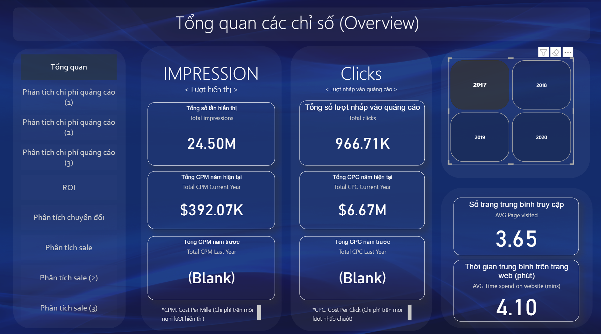

# Marketing-Performance-Dashboard
A data analytics dashboard for tracking and evaluating marketing performance across advertising channels and campaigns. The dashboard analyzes key metrics such as impressions, clicks, conversions, and campaign effectiveness to support data-driven marketing decisions.
# Marketing Performance Dashboard

## Marketing Campaign Performance Overview

### 1. Impressions (Lượt hiển thị)

**Total Impressions:** 24.50M  

**Total CPM (Current Year):** $392.07K  

**Total CPM (Last Year):** Not available  

**Insight:**  
The campaign generated a large number of impressions, indicating strong visibility. However, the absence of last year’s CPM data limits year-over-year comparison.

---

### 2. Clicks (Lượt nhấp vào quảng cáo)

**Total Clicks:** 966.71K  

**Total CPC (Current Year):** $6.67M  

**Total CPC (Last Year):** Not available  

**Insight:**  
Nearly one million clicks show significant engagement. The high CPC cost suggests that while engagement is strong, efficiency should be monitored to ensure ROI.

---

### 3. User Engagement

**Average Pages Visited:** 3.65  

**Average Time Spent on Website:** 4.10 minutes  

**Insight:**  
Users are exploring multiple pages and spending a reasonable amount of time on the site. This indicates meaningful interaction beyond just clicking ads.

---

### 4. Year Selection

Current dashboard view is filtered for **2017**.

Available filters:

- 2018  
- 2019  
- 2020  

**Insight:**  
The dashboard allows year-by-year performance tracking, but the current analysis is limited to 2017 data.

---

### 5. Overall Observations

- Strong visibility (high impressions)  
- Solid engagement (clicks and time on site)  
- High advertising costs (CPC and CPM) may require optimization

